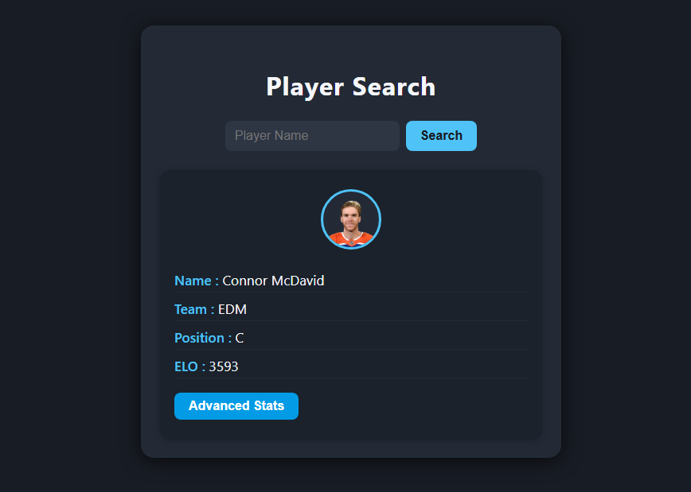
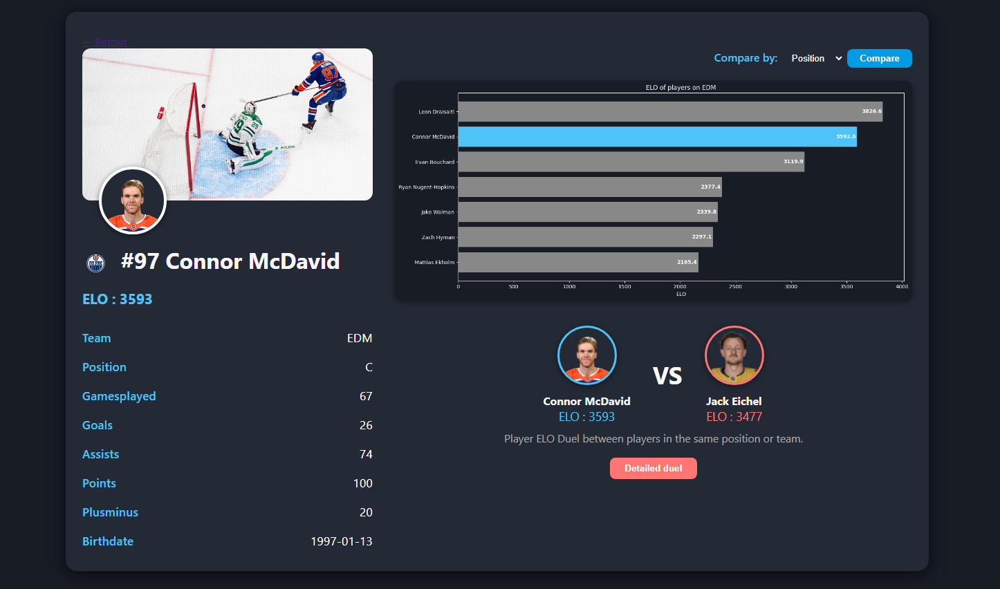
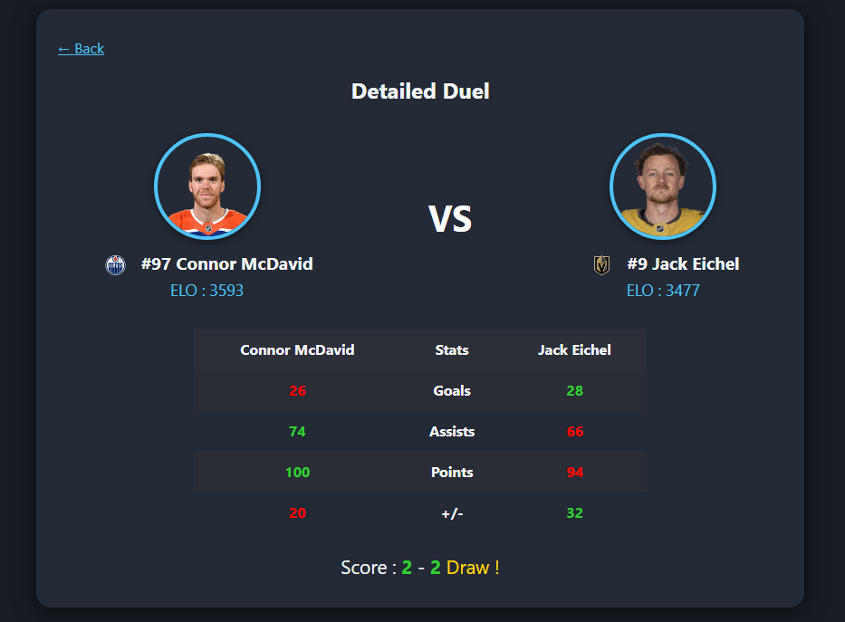

# 🏒 NHLStats


**NHLStats** is a modern web application for exploring advanced NHL player statistics, visualizations, and comparisons.  
Built with Python, Flask, and Matplotlib.

---

## 🚀 Features

- 📊 **Player ELO Rankings:** Custom ELO system to evaluate player performance.
- 🏒 **Detailed Player Pages:** Stats, ELO, team info, and more.
- ⚔️ **Player Duel:** Compare two players head-to-head with stat-by-stat breakdown and winner.
- 📈 **Interactive Graphs:** Visualize top players by ELO, position, or team.
- 🔎 **Search:** Find players by name, team, or position.
- 🏆 **Best in Position:** Crown emoji for the top ELO at each position.
- 🌐 **REST API:** Access player data and graphs programmatically.

---

## 📷 Screenshots

<div align="center">
  
  <br>
  
  <br>
  
</div>


---

## 🛠️ Installation

1. **Clone the repository:**
   ```bash
   git clone https://github.com/your-username/nhlstats.git
   cd nhlstats
   ```

2. **Install dependencies:**
   ```bash
   pip install -r requirements.txt
   ```

3. **Collect latest NHL data:**
   ```bash
   python main.py -c
   ```

4. **Run the web app:**
   ```bash
   python main.py -w
   ```
   The app will be available at [http://localhost:5001](http://localhost:5001).

---

## ⚡ Usage

- **Search for a player** on the home page.
- **Click a player** to view detailed stats and ELO.
- **Use the Duel feature** to compare two players.
- **Access the API** at `/api/players`, `/api/player/<id>`, `/api/top_players_graph`.

---

## 🧩 Project Structure

```
nhlstats/
│
├── src/
│   ├── nhlstats/
│   │   ├── app.py
│   │   ├── logic/
│   │   │   ├── collector.py
│   │   │   ├── analyst.py
│   │   │   └── statistics/
│   │   ├── templates/
│   │   │   ├── index.html
│   │   │   ├── player_detail.html
│   │   │   └── duel.html
│   │   └── ...
│   └── api/
│       └── api.py
├── main.py
└── requirements.txt
```

---

## 📡 API Endpoints

- `GET /api/players` — All players and ELOs
- `GET /api/player/<id>` — Single player info
- `GET /api/top_players_graph?n=10` — Top N players ELO graph (PNG)

---

## 🤝 Contributing

Pull requests are welcome!  
For major changes, please open an issue first to discuss what you would like to change.

---

## 📄 License

This project is licensed under the MIT License.

---

## 🙏 Acknowledgements

- NHL API & public data sources
- [Flask](https://flask.palletsprojects.com/)
- [Matplotlib](https://matplotlib.org/)
- [FontAwesome](https://fontawesome.com/) for icons

---

<div align="center">
  
  <br>
  <b>Enjoy exploring NHL stats!</b>
</div>
